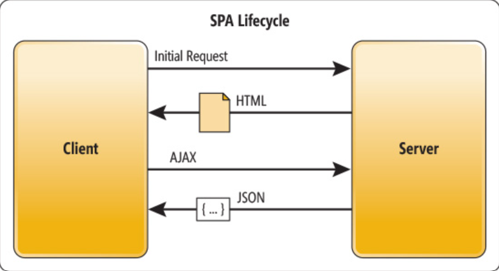

# React가 SPA를 구현하는 방법
## React Router
`React Router`는 단순히 URL을 함수나 구성 요소와 일치시키는 것이 아니다. 
It is the culmination of mapping the entire user interface. 

### react 라우터를 활용하였을때 어떻게 내 앱을 구축하는데 도움이 될지
AND
what exactly is the router and what does it do?

### Recap on SPA

Traditionally web applications used to be rendered via Server side (SSR).
화면에 보여질 리소스를 서버로 요청하고 서버로부터 받아온 리소스를 렌더링 하였다.

하지만 SPA는 렌더링의 역할을 서버에게 넘기지 않고 브라우저에서 처리하는 방식이다.
웹 application에 필요한 모든 정적 리소스를 최초에 한번 다운로드하고, 새로운 페이지 요청이 있을떄 마다 필요한 데이터만 전달받아 페이지를 갱신한다.
SPA would download all resources in the first instance, then whenever the page requests new data, refreshes those data only.

### 장점 Strengths!
전체 렌더링 하지 않기 떄문에, overall traffic reduction and rendering effiency를 가진다.
- 빠른 화면 이동 가능!
- 앱처럼 자연스로운 사용자 경험 제공 (UX), great for mobile interfaces
### 단점 Weaknesses & shortcomings!
- 초기 구동속도가 느린편 🐌
- SPA구조상 데이터 처리를 client 에서 하는 경우가 많음
- 해당 로딕들은 JavaScript를 통해 구현, 외부에 노출되는 보안적인 security 문제가 발생할 수 있다.

## 🔌 라우팅 Routing
To understand routing, we must first look at how the web runs overall
웹사이트를 방문하면 일반적으로 도메인 이름뒤에 경로를 첨부한다.
`https://.../welcome`
this website would load /welcome. 주소창에 다른 URL을 입력하면 해당하는 다른 페이지가 로딩된다. 이렇게 웹사이트에 표시되는 콘텐츠가 URL에 맞게 변경된다.

### This is what routing is

라우터를 적절히 활용함여, 현재 사용 중인 URL을 감시하게 되고, 이 URL이 변경될 떄마다 작동하여 화면에 다른 콘첸츠를 표시하게 된다. Depending on the URL, different components are rendered and loaded instead of requesting resources from the backend. 

## ⚖️ 리액트 라우트 정의
We must first use the `react-router-dom` library

`$ npm install react-router-dom`
지원하는 `createBrowserRouter`함수를 통해 우리가 이 application에서 지원하려는 라우트를 정의할 수 있다. 해당 함수에 각각 하나의 라우트를 나타내기 위해, 라우트 객체로 이루어진 `array`를 넣어준다.
```javascript
function App() {
  const router = createBrowserRouter([
    {
      path: "/",
      element: <Layout />,
      children: [
        { path: "", element: <HomePage /> },
        {
          path: "events",
          element: <EventLayout />,
        },
        {
          path: "newsletter",
          element: <NewsletterPage />,
        },
      ],
    },
  ]);
});
```
### Let's take a look at each of the properties!
- `path`
이 라우트가 작동해야 하는 경로를 정의한다. *주의* 이 path는 도메인 뒤에 있는 부분을 뜻한다! 즉 `example.com`이라는 웹사이트, 이부분이 도메인 이름이고 후에 나오는 부분이 path에 지정할 URL이다. 
example: `example.com/events` would be /events. `/`는 따라서 도메인 뒤에 어떠한 URL도 없는 경우일 테고 주로 홈페이지를 의미할 것이다. 
- `element`
URL을 변경하였으면 화면에 새로운 콘텐츠를 표시해주어야 한다. 즉 라우터가 활성화 되면 로딩되어야 하는 컴포넌트에 대한 정보를 의미한다. 해당 라우트 경로가 활성화되면 `element`에서 지정한 component의 `jsx` code가 로딩될 것이고 화면에 그 코드에 맞는 스크린이 rendering되는 것이다.

#### We will come back to `children` later

- `createBrowserRouter()` 함수를 통해 라우트 객체를 생성하였고, 활성화시에 표시되어야 할 콘첸츠 (component)또한 정의하였다

이제는, `createBrowserRouter()` 함수가 반환하는 값인 라우터를 통해 react에게 "이 라우터를 사용할 거야" 라고 알려주어야 한다.

```javascript
return (
  <>
    <RouterProvider router={router}>
    <Layout />
    </RouterProvider>
  </>
);
```
In the code above, `createBrowserRouter`가 반환한 상수 값인 router를 react-router-dom에 제공하는 `RouterProvider` component의 특수한 property `router`에 넣어 우리가 application에서 제공하고자 하는 `App.js`의 최상위 component를 감싸준다. 이렇게 우리는 정의한 react router를 사용할 수 있게 되었다 🤓

<br>

some may be more familiar with the jsx code like below

```javascript
<Routes>
  <Route path="/" element={<HomePage />}>
  <Route path="/events" element={<EventLayout />}>
</Routes>
```
We can use the `createBrowserFromElements()` function to define it as well
```javascript
const routerDefinition = createBrowserFromElements(
  <Routes>
    <Route path="/" element={<HomePage />}>
    <Route path="/events" element={<EventLayout />}>
  </Routes>
);

const route = createBrowserRouter(routerDefinition);
```
라우트 정의 방식은 *선택* 사항이라고 생각한다. You can use whichever you are more comfortable with!
# 📃 페이지 이동하기 Page Navigation 
There are three page navigation methods via `react-router-dom`. `Link`, `NavLink`, and `useNavigate` 
## Link
HTML의 대표적인 Tag중 하나로 `a` tag exists. You can use this tag to navigate to a URL with the `href` property.
this `a` anchor tag의 단점
> 앵커 태그를 사용하였을 시, 새로운 페이지로 이동하면 이 website를 지원하는 서버에 계속하여 새로운 요청을 전송한다. of course, all the JavaScript 코드 will be reloaded, and the whole application would be reloaded and restarted. 배후에서 많은 불필요한 작업이 일어나 성능에 영향을 미친다.
In comparison, `Link`는 배후에서 앵커 요소를 rendering하게 된다. 기본적으로 그 요소에 대한 click을 감시하며, once a link is clicked, it blocks the HTTP request that the browser usually sends. 따라서 라우트를 확인하여 그에 맞춰 페이지를 업데이트 하고, 적절한 contents를 로딩한다.

따라서 `<a>` 와는 달리 새로운 http요청을 하지 않음으로써, it reduces the page loading time
```javascript
<Link to="/events">Go to EventsPage</Link>
```
## useNavigate
우리는 `Link` tag를 지정함으로써 `UI`적인 page navigation을 구현한다. 즉, 화면 상에 특정 element를 클릭함으로써 페이지 이동이 구현된다. 하지만 필요에 따라 자주 "프로그램"적인 "로직"을 통한 페이지 이동이 필요하다. 특정 함수를 호출함으로써 여러 잡업을 수행한후 마지막에 페이지를 이동한다거나, `setTimeout`을 활용하여 몇 초후에 페이지 이동을 명령할 수 있어야 한다. 

이러한 상황에서 `useNavigate`를 사용한다. 
```javascript
const navigate = useNavigate();

function GoToEventsPage(){
  // ... 여러 작업 수행
  navigate("/events");
}
```
After all the 작업 수행후 lastly, `navigate`를 통해 페이지를 이동한다.
## NavLink
`NavLink`는 현재 링크가 `isActive` state, `isPending` state인지 알 수 있는 `Link`태그의 특별한 종류 중 하나이다.
```js
import { NavLink } from "react-router-dom";

<NavLink
  to="/messages"
  className={({ isActive, isPending }) => 
    isPending ? "pending" : isActive ? "active" : ""
  }
>
  Messages
</NavLink>
```
It specifies the style of the current message by applying a different className depending on whether the current route is active or pending. By using NavLink, it’s even easier to indicate whether a link is currently active.

Unlike Link, NavLink accepts a function for the className or style properties, rather than just standard values. This function can access the Boolean isActive and isPending properties provided by react-router-dom, allowing conditional styling based on the current active state.

# Conclusion for now
There are way more things to get into regarding React router and the way react components can be rendered on a single page. 앞으로 강의와 자료들을 참고하며, 실수 미니 프로젝트를 통해서 더 자세히 다뤄보고 이해할 예정이다.
