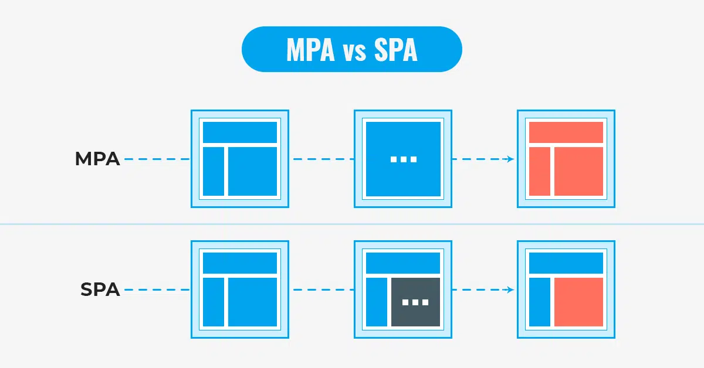
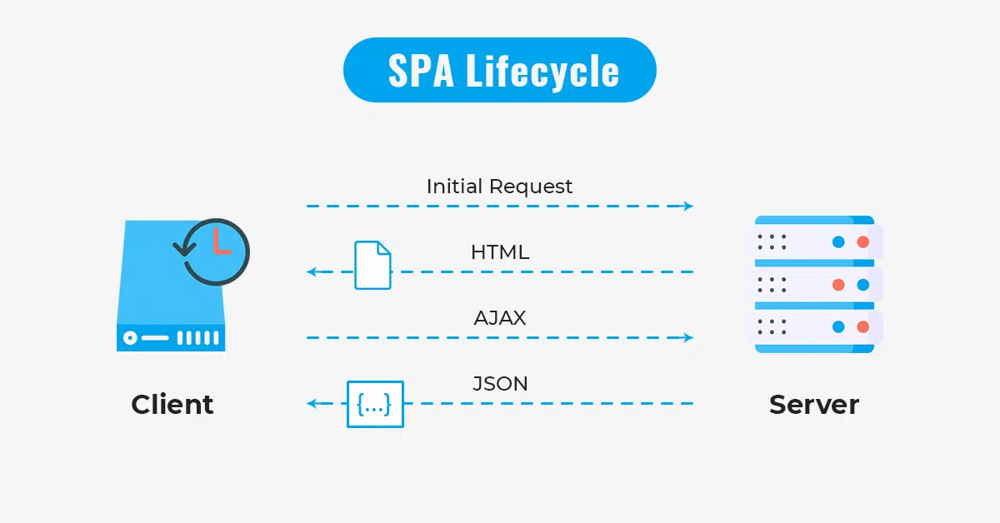

리엑트에서 상태관리를 하는 과정
## 왜 이렇게 복잡한 과정을 거칠까?
상태 변경을 감지하고 화면을 업데이트하는 React의 작동방식 떄문!

리엑트
SPA Library

# What is SPA Library?
SPA
: Single Page Application
한 개의 페이지로 구성된 애플리케이션

MPA
: Multi Page Application
여러 개의 페이지로 구성된 애플리케이션

## MPA Method
- traditional 
- client to server
- client portrays the html from the server
SSR 
: Server Side Rendering

클라이언트에서 새로고침한다 

플리커 (Flicker) 현상 발생! 

빈페이지가 깜빡이고 다시 구현된다

Not good for the user to see

Therefore...

## SPA Method
- client requests
- server sends empty HTML
CSR 
: Client Side Rendering

- client continually requests required data to server 

지웠다가 다시 표출해야 하는 과정이 없어서, no more flicker 현상!

## Brief history of Web
Normally web applications used the MPA rendering method as one moved from one page to the other. However as websites had more and more pages, the speed of loading the whole page was a problem.

To solve this problem, programmers in the early 2000s used AJAX to help effiency of the MPA method. This optimized it for a bit but could not solve the root of the problem.

After about 10 years, the SPA model was launched. This was an upgrade from the MPA + AJAX versions. SPA would request the data and layout seperately, and render the results directly on the browser. (ex. user's online shopping experience: color, brand can be rendered on screen without having to refresh the whole page.)

### AJAX? 
- Asynchronous JavaScript and XML
- created for fast responsive websites
- AJAX communicates with the server to refresh a certain part of the web page

### SPA vs MPA
#### SPA (Single Page Application)

### 개념
- Modern web paradigm
- application rendered on a single page
- does not request a completely new page from the server
- core value includes UX (user experience), and application speed - mobile first 

### 작동 방식
- SPA downloads all the required resources for the we application one time
- new page requests go thorough receiving the data in JSON format
- normally used in conjunction with CSR (Client Side Rendering)

장점:
1. 속도 및 응답시간
속도는 전반적인 사용자 경험을 향상시키는 데 중요한 요소이다.
전체 페이지를 다시 렌더링 할 필요없이 변경되는 부분만 갱신한다. 새로고침이 발생하지 않아 네이티브 앱과 유사한 사용자 경험을 제공.
2. 모바일 친화적
모바일 앱도 SPA와 동일한 아키텍처에서 개발되므로 모바일 개발을 염두해두면 동일한 백엔드 코드를 재사용하도록 할 수 있다.
3. 개발 간소화 
서버에서 페이지를 렌더링 하기 위해 코드를 작성할 필요가 없다. SPA는 보다 "현대적인" 것으로 간주되며 오늘날의 민첩한 개발 요구 사항에 적합하다.
4. 로컬 스토리지 캐시
SPA는 모든 로컬 스토리지를 효과적으로 캐시할 수 있다. application은 하나의 요청만 보내고 모든 데이터를 저장한 다음 이 데이터를 사용할 수 있으며 오프라인에서도 작동한다. 

단점: 
1. 초기 구동 속도
SPA는 웹 애플리케이션에 필요한 모든 정적 리소스를 최초 접근시 단 한번 다운로드 하기 떄문에 초기 구동 속도가 상대적으로 느리다.
2. SEO (search engine optimization) 이슈
SPA는 JavaScript로 구축된다. (CSR 방식) 자바스크립트를 읽지 못하는 검색 엔젠에 대해서 크롤링이 되지않아 색인이 되지 않는 문제가 발생할 수 있다.
3. 보안 문제
XSS(교차 사이트 스크립팅)로 인해 공격자가 다른 사용자가 웹 응용 프로그램에 클라이언트 측 스크립트를 삽입할 수 있는 위험이 있다.

#### 예시
- Gmail
- Google Maps
- GitHub
- Facebook

### Remember for React!
상태 밴경 함수 샐행 => 상태 변경 인지 => 변경된 상태를 사용하는 컴포넌트만 업데이트

상태 변경 => rerendering

## 가상 DOM
UI의 상태 변화를 실제 DOM에 직접 반영하기 전에 가상의 DOM을 만든 다음 실제 DOM과 비교해서 최소한의 변경만 실제 DOM에 적용하는 방식